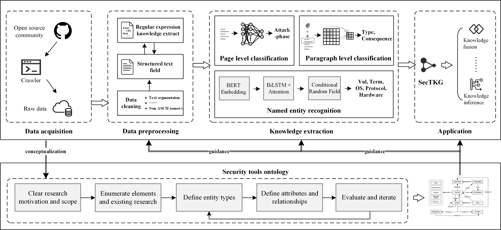

# KnowledgeExtractionModule

## Architecture

## Directory
- PageLevelModel.py: implementation of page level classification model. 
- ParagraphLevelModel.py: implementation of paragraph level classification model.
- EntityRecognitionModel.py: implementation of recognition model for 5 types of entities.